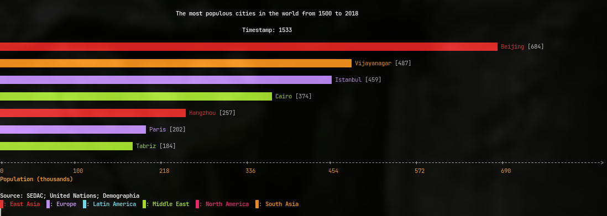
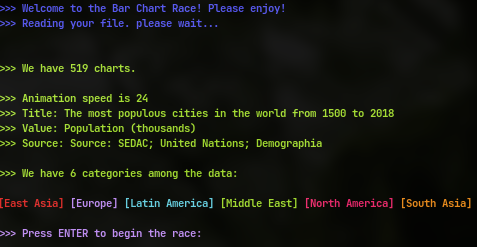

# Introduction

<!-- TODO -->
### Welcome to the Bar Chart Race!



This project displays a race between bars in a bar chart, a common data visualization technique to present growth
of categorical data over time.

In this project, we put 1 up to 15 horizontal bars in a chart to race,
each of the bars representing a data object (which is part of a category), with its length representing this data point's value.
The race follows the data in a temporal series, advancing through timestamps. All the data, timestamps, labels and such are gotten from
a datafile, passed by the user.

Each category will have its own color, and the program has up to 14 colors. In the case that the number of categories surpasses the number of colors, all the categories will have the same color.

The race is done by printing out "BarChart" objects, each one representing a "frame" of the race, with its own bars, values, and associated to a single timestamp.
The illusion of animation is done by pausing the execution of our program based on a set value "FPS" before printing out the next chart, and rolling up the screen after each chart is printed.

# Compiling

First of all, in the main folder, unzip the file that contains all the data. This can be done in a Linux Terminal quite easily, just by writing out: 

```console
$ unzip data.zip
```

Next, create the folder where you'll build the executables, go into it and build with CMake, as follows:

 ```console
$ mkdir build
$ cd build
$ cmake ../
$ cmake --build .
 ```

# Running

With the project built, this will be the syntax of the command for running the race (please run from inside the build folder): 

```console
$ ./bcr [<options>] <data_file_path>
    Options:
        --b <num>            Maximum number of bars in the race, from 1 to 15. Default = 5.
        --f <num>            Number of frames presented per second (animation speed), 
                               from 1 to 24. Default = 24.
```
The options are auto adjusted inside the program, so if you go out of range, it'll self adjust to the maximum of the parameter. After the options goes the path to the data textual file.
As said before, a folder with proper data files is already on the repository, but feel free to produce new ones, just look at the format of the file and get your own going.

An example of a run with a datafile from the data folder and all the options available would be: 

```console
$ ./bcr --b 7 ../data/cities.txt
```


This'll get the start prompt above. Just press Enter and enjoy the race!
